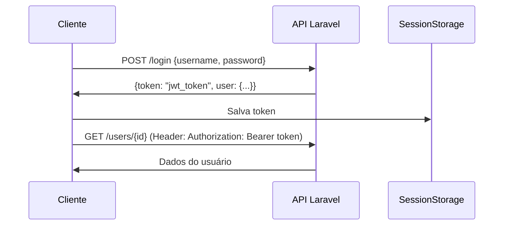

# 🌐 Gerenciador de Empregos - Cliente

> Interface web para gerenciamento de candidatos a vagas de emprego  
> **Frontend:** HTML5, CSS3, JavaScript ES6+  
> **Backend:** Laravel 12 REST API

---

## 📋 Sobre o Projeto

Sistema web desenvolvido para a disciplina de **Tecnologias Cliente Servidor**, permitindo o gerenciamento completo de perfis de candidatos a vagas de emprego.

### 🎯 Funcionalidades Principais

- 📝 **Cadastro de usuários** com validação de dados
- 🔐 **Login seguro** com autenticação JWT
- 👤 **Gerenciamento de perfil** (visualizar, editar, excluir)
- ⚙️ **Configuração dinâmica do servidor** (sem precisar editar código!)
- 🌐 **Suporte a múltiplos ambientes** (local, rede, VPN, nuvem)
- 📱 **Design responsivo** e moderno

---

## 🚀 Como Executar o Projeto

### 📋 Pré-requisitos

1. **Backend Laravel 12** rodando (veja instruções no repositório do backend)
2. Navegador web moderno (Chrome, Firefox, Edge, Safari)
3. *(Opcional)* Servidor HTTP local

### 🔧 Instalação e Execução

#### **Opção 1: Abrir Diretamente no Navegador**

```bash
# 1. Clone o repositório
git clone https://github.com/GiovanneMika/gerenciador-empregos-cliente.git

# 2. Entre na pasta
cd gerenciador-empregos-cliente

# 3. Abra o arquivo index.html no navegador
# Windows
start index.html

# macOS
open index.html

# Linux
xdg-open index.html
```

#### **Opção 2: Servidor HTTP Local (Recomendado)**

**Com Python:**
```bash
# Python 3.x
python -m http.server 8080

# Acesse: http://localhost:8080
```

**Com Node.js:**
```bash
# Instalar http-server globalmente (apenas uma vez)
npm install -g http-server

# Executar servidor
http-server -p 8080

# Acesse: http://localhost:8080
```

**Com PHP:**
```bash
php -S localhost:8080

# Acesse: http://localhost:8080
```

#### **Opção 3: VS Code Live Server**

1. Instale a extensão **Live Server** no VS Code
2. Clique com botão direito em `index.html`
3. Selecione **"Open with Live Server"**
4. O navegador abrirá automaticamente

---

## ⚙️ Configuração Inicial

### 1️⃣ **Configure o Servidor Backend**

Na primeira vez que acessar o sistema:

1. Você será redirecionado para a tela de **Login**
2. Clique em **"⚙️ Configurar Servidor"** (canto inferior direito ou link na página)
3. Digite a URL do seu servidor Laravel:
   ```
   http://localhost:8000        # Servidor local
   http://192.168.1.10:8000    # Servidor na rede local
   http://26.13.125.160:8000   # Servidor via VPN (Hamachi/Radmin)
   https://api.exemplo.com     # Servidor em produção
   ```
4. Clique em **"🧪 Testar Conexão"** para verificar
5. Se aparecer ✅ **"Conexão bem-sucedida!"**, clique em **"💾 Salvar"**

> ⚠️ **Importante:** NÃO adicione `/api` no final da URL!

### 2️⃣ **Crie sua Conta**

1. Na tela de login, clique em **"Cadastre-se"**
2. Preencha os dados:
   - **Nome Completo** (obrigatório)
   - **Username** (obrigatório, único, imutável)
   - **Senha** (obrigatório, apenas alfanumérico)
   - **Email** (opcional, mas recomendado)
   - **Telefone** (opcional)
   - **Experiência** (opcional)
   - **Formação** (opcional)
3. Clique em **"Cadastrar"**
4. Você será redirecionado para o login

### 3️⃣ **Faça Login e Use o Sistema**

1. Digite seu **username** e **senha**
2. Clique em **"Entrar"**
3. Você será levado ao **Painel do Usuário**
4. A partir daí você pode:
   - ✏️ **Editar seus dados**
   - 🗑️ **Deletar sua conta**
   - 🚪 **Fazer logout**

---

## 📂 Estrutura do Projeto

```
gerenciador-empregos-cliente/
│
├── 📁 pages/                    # Páginas HTML
│   ├── login.html              # Tela de login
│   ├── cadastro.html           # Tela de cadastro
│   ├── painel.html             # Painel do usuário (área logada)
│   ├── editar.html             # Edição de perfil
│   └── config-server.html      # Configuração do servidor
│
├── 📁 assets/                   # Recursos estáticos
│   ├── 📁 css/                 # Arquivos de estilo
│   │   ├── style.css           # Estilos globais (login, cadastro, config)
│   │   ├── painel.css          # Estilos do painel e edição
│   │   └── config-server.css   # Estilos da configuração
│   └── 📁 js/                  # Scripts JavaScript
│       └── api.js              # Módulo de comunicação com a API
│
├── 📁 docs/                     # Documentação adicional
│   ├── GUIA-CONFIGURACAO.txt   # Guia rápido de configuração
│   └── CHANGELOG.md            # Histórico de alterações
│
├── 📄 index.html                # Página inicial (redireciona automaticamente)
├── 📄 README.md                 # Este arquivo
├── 📄 README.txt                # Versão em texto plano
├── 📄 .gitignore                # Arquivos ignorados pelo Git
└── 📄 LICENSE                   # Licença MIT
```

---

## 🛠️ Tecnologias Utilizadas

### **Frontend**
- **HTML5** - Estrutura semântica das páginas
- **CSS3** - Estilização moderna com gradientes, animações e responsividade
- **JavaScript ES6+** - Lógica, validações e comunicação com API

### **Recursos Web**
- **Fetch API** - Requisições HTTP assíncronas
- **LocalStorage** - Armazenamento persistente (configuração do servidor)
- **SessionStorage** - Armazenamento temporário (tokens JWT)

### **Backend (Separado)**
- **Laravel 12** - Framework PHP para API REST
- **MySQL/PostgreSQL** - Banco de dados
- **JWT** - Autenticação via tokens (60 minutos de validade)

---

## 🔐 Sistema de Autenticação

### **Fluxo de Login**



### **Proteção de Rotas**

- ✅ Todas as requisições (exceto login/cadastro) incluem: `Authorization: Bearer {token}`
- ✅ Token expira em **60 minutos** - após isso, é necessário fazer login novamente
- ✅ Cada usuário só pode acessar/editar seu próprio perfil
- 🔒 Tentativas de acessar outros perfis retornam **403 Forbidden**

---

## 📡 API - Endpoints do Laravel

| Método   | Rota          | Descrição                    | Autenticação |
|----------|---------------|------------------------------|--------------|
| `POST`   | `/users`      | Criar novo usuário           | ❌ Não       |
| `POST`   | `/login`      | Autenticar usuário           | ❌ Não       |
| `GET`    | `/users/{id}` | Obter dados do usuário       | ✅ Sim       |
| `PATCH`  | `/users/{id}` | Atualizar dados do usuário   | ✅ Sim       |
| `DELETE` | `/users/{id}` | Deletar conta do usuário     | ✅ Sim       |
| `POST`   | `/logout`     | Invalidar token (logout)     | ✅ Sim       |

### **Exemplo de Requisição**

```javascript
// Login
POST http://localhost:8000/login
Content-Type: application/json

{
  "username": "joao123",
  "password": "senha123"
}

// Resposta
{
  "token": "eyJ0eXAiOiJKV1QiLCJhbGc...",
  "user": {
    "id": 1,
    "username": "joao123",
    "name": "JOÃO SILVA",
    "email": "joao@email.com"
  }
}
```

---

## 🎨 Validações e Regras

### **Cadastro de Usuário**

| Campo        | Obrigatório | Regras                                    |
|--------------|-------------|-------------------------------------------|
| Nome         | ✅ Sim      | Mínimo 3 caracteres                       |
| Username     | ✅ Sim      | Único, apenas letras/números/underscore   |
| Senha        | ✅ Sim      | Apenas alfanumérico (sem especiais)       |
| Email        | ❌ Não      | Único, formato válido                     |
| Telefone     | ❌ Não      | Livre                                     |
| Experiência  | ❌ Não      | Livre                                     |
| Formação     | ❌ Não      | Livre                                     |

### **Regras de Negócio**

- 🔒 **Username** é único e **não pode ser alterado** após criação
- 📧 **Email** é único mas pode ser alterado
- 🔤 **Nome** é convertido para MAIÚSCULAS automaticamente pelo backend
- 🔑 **Senha** deve ser alfanumérica (Laravel valida)
- ⏱️ **Token JWT** expira em 60 minutos

- ⏱️ **Token JWT** expira em 60 minutos

---

## � Solução de Problemas

### ❌ **Erro: "Falha na conexão com o servidor"**

**Possíveis causas:**
- Backend Laravel não está rodando
- URL do servidor configurada incorretamente
- Firewall bloqueando a porta
- CORS não configurado no Laravel

**Solução:**
1. Verifique se o Laravel está rodando:
   ```bash
   php artisan serve
   # Deve mostrar: Server running on [http://localhost:8000]
   ```
2. Vá em **"⚙️ Configurar Servidor"**
3. Clique em **"🧪 Testar Conexão"**
4. Ajuste a URL se necessário
5. Verifique as configurações de CORS no Laravel (`config/cors.php`)

### ❌ **Erro: "Invalid Token" ou "Unauthenticated"**

**Causa:** Token JWT expirado (válido por 60 minutos)

**Solução:**
- Faça **logout** e **login** novamente
- Um novo token será gerado

### ❌ **Erro: "403 Forbidden"**

**Causa:** Tentando acessar ou editar perfil de outro usuário

**Solução:**
- Você só pode visualizar/editar seu próprio perfil
- Cada usuário tem acesso restrito aos seus dados

### ❌ **Erro: "CORS Policy"**

**Causa:** Backend Laravel sem CORS configurado

**Solução no Backend Laravel:**
```php
// config/cors.php
'paths' => ['*'],
'allowed_origins' => ['*'],
'allowed_methods' => ['*'],
'allowed_headers' => ['*'],
```

### ❌ **Campos não salvam ao editar**

**Causa:** Campos vazios não sendo enviados

**Solução:** Já corrigido! O sistema agora envia strings vazias (`""`) para o backend.

---

## 👥 Trabalho em Equipe / Colaboração

### **Cenário 1: Servidor Local (mesma máquina)**

```bash
# No backend Laravel
php artisan serve
# Servidor rodando em: http://localhost:8000

# No frontend (cliente)
# Configure: http://localhost:8000
```

### **Cenário 2: Servidor na Rede Local (LAN)**

**Máquina 1 (Backend Laravel):**
```bash
# Descubra seu IP local
ipconfig           # Windows
ip addr show       # Linux
ifconfig           # macOS

# Exemplo de IP: 192.168.1.10

# Inicie o Laravel permitindo conexões externas
php artisan serve --host=0.0.0.0 --port=8000
# ou
php artisan serve --host=192.168.1.10 --port=8000
```

**Máquina 2 (Frontend Cliente):**
1. Abra o sistema no navegador
2. Vá em **"⚙️ Configurar Servidor"**
3. Digite: `http://192.168.1.10:8000`
4. Teste e salve

### **Cenário 3: Via VPN (Hamachi / Radmin VPN)**

**Máquina 1 (Backend):**
```bash
# Conecte-se à VPN (Hamachi, Radmin, etc.)
# Descubra o IP da VPN (ex: 26.13.125.160)

# Inicie o Laravel com o IP da VPN
php artisan serve --host=26.13.125.160 --port=8000
```

**Máquina 2 (Frontend):**
1. Conecte-se à mesma rede VPN
2. Configure: `http://26.13.125.160:8000`

### **Cenário 4: Servidor em Produção (Nuvem)**

```bash
# Backend em servidor (Heroku, DigitalOcean, AWS, etc.)
# Ex: https://api.meuapp.com

# Configure no frontend:
https://api.meuapp.com
```

---

## 📚 Estrutura de Dados

### **Modelo de Usuário (User)**

```json
{
  "id": 1,
  "username": "joao123",
  "name": "JOÃO SILVA",
  "email": "joao@email.com",
  "phone": "11999998888",
  "experience": "5 anos em desenvolvimento web",
  "education": "Bacharelado em Ciência da Computação",
  "created_at": "2025-10-20T10:30:00.000000Z",
  "updated_at": "2025-10-20T10:30:00.000000Z"
}
```

---

## 🔧 Configuração do Backend Laravel

### **Requisitos do Backend**

- PHP 8.2+
- Laravel 12
- MySQL 8.0+ ou PostgreSQL 13+
- Composer

### **Endpoints Necessários**

O backend Laravel deve implementar os seguintes endpoints:

```php
// routes/api.php ou routes/web.php

POST   /users        # Criar usuário
POST   /login        # Autenticar
GET    /users/{id}   # Obter usuário (autenticado)
PATCH  /users/{id}   # Atualizar usuário (autenticado)
DELETE /users/{id}   # Deletar usuário (autenticado)
POST   /logout       # Logout (autenticado)
```

### **Configurações Essenciais**

```env
# .env do Laravel
APP_URL=http://localhost:8000

# Configurar CORS
SANCTUM_STATEFUL_DOMAINS=localhost:8080,127.0.0.1:8080
```

---

## 🎨 Design e Interface

### **Paleta de Cores**

- **Primary:** `#667eea` → `#764ba2` (Gradiente Roxo)
- **Success:** `#4facfe` → `#00f2fe` (Gradiente Azul)
- **Danger:** `#fc8181` → `#f56565` (Gradiente Vermelho)
- **Info:** `#4299e1` (Azul)
- **Secondary:** `#718096` → `#4a5568` (Gradiente Cinza)

### **Recursos Visuais**

- ✨ Animações suaves e modernas
- 🎨 Gradientes vibrantes
- 📱 Design totalmente responsivo
- ♿ Interface acessível e intuitiva
- 🌙 Sombras e profundidade

---

## 🤝 Contribuindo

1. Faça um **fork** do projeto
2. Crie uma **branch** para sua feature:
   ```bash
   git checkout -b feature/MinhaNovaFeature
   ```
3. **Commit** suas mudanças:
   ```bash
   git commit -m 'Adiciona MinhaNovaFeature'
   ```
4. **Push** para a branch:
   ```bash
   git push origin feature/MinhaNovaFeature
   ```
5. Abra um **Pull Request**

---

## 📄 Licença

Este projeto está sob a licença **MIT**. Veja o arquivo [LICENSE](LICENSE) para mais detalhes.

---

## 👨‍💻 Autor

**GiovanneMika**  
📧 GitHub: [@GiovanneMika](https://github.com/GiovanneMika)

---

## 🎓 Contexto Acadêmico

**Disciplina:** Tecnologias Cliente Servidor  
**Projeto:** Sistema de Gerenciamento de Candidatos a Vagas  
**Semestre:** 2025.1

---

## 📖 Documentação Adicional

- 📘 [GUIA-CONFIGURACAO.txt](docs/GUIA-CONFIGURACAO.txt) - Guia rápido
- 📗 [CHANGELOG.md](docs/CHANGELOG.md) - Histórico de versões
- 📕 [README.txt](README.txt) - Versão texto plano

---

⭐ **Desenvolvido com dedicação para a disciplina de Tecnologias Cliente Servidor**
